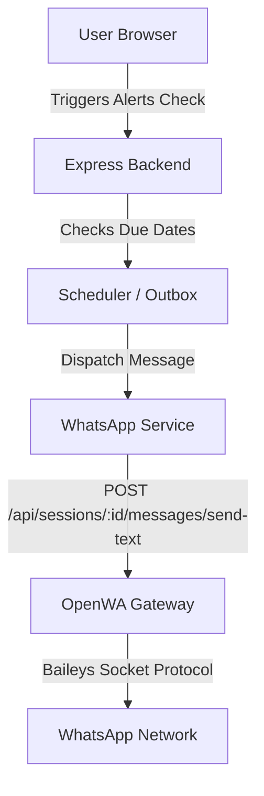

# WhatsApp Integration & Notification System Status

This document provides a comprehensive summary of the local WhatsApp automation engine and notification system integrated into the **EMI Management & Loan Intelligence Platform**.

---

## 1. Core Architecture Overview

The system uses a standalone instance of the **OpenWA API Gateway** running in a child process alongside the Express backend. Communication flows as follows:

---

## 2. Key Components & Implementation Details

### A. Standalone OpenWA API Gateway (`services/openwaClient.js`)
*   **File Link:** [openwaClient.js](./backend-platform/services/openwaClient.js)
*   **Startup & Process Management:** Spins up the gateway on port `2785` as a child process using the command `node dist/main.js` from `node_modules/openwa`.
*   **Baileys Engine:** Configured to use the `baileys` socket engine (`ENGINE_TYPE=baileys`). This engine directly interfaces with WhatsApp's socket protocol, bypassing headless Chromium/Puppeteer entirely. This avoids a 150MB browser download, significantly reduces CPU/memory footprint, and operates much more stably.
*   **UUID Resolution:** The gateway assigns a unique database UUID to each session. At startup, the client registers the session (`default-session`), resolves its UUID (either from the creation response or by querying the sessions list on Conflict), and uses that UUID for all subsequent actions (starting the session, checking QR status, and sending messages).

### B. WhatsApp Service Wrapper (`services/whatsappService.js`)
*   **File Link:** [whatsappService.js](./backend-platform/services/whatsappService.js)
*   **Text & Template Messages:** 
    *   Exposes `sendWhatsAppMessage(to, message)` which directly makes a `POST` request to the gateway's send endpoint.
    *   Exposes `sendWhatsAppTemplate(to, templateName, language, components)` which translates structured templates (like `hello_world` or custom notification alerts) into clean text messages before dispatching them.

### C. Public & Authorized Routing (`server.js`)
*   **File Link:** [server.js](./backend-platform/server.js)
*   **Public Linking Routes:**
    *   `GET /api/loans/whatsapp-qr` and `POST /api/loans/whatsapp-qr/start` are mounted *before* the Express `protect` middleware. This makes the QR code scanning and linking page public and accessible directly via browser.
    *   These endpoints query the gateway for status. If authenticated, it displays the session as `ready` and notes that no QR code is needed. If disconnected, it provides a "Start Session" button. If authenticating, it renders the live QR code.
*   **Notification Preference Endpoints:**
    *   `PATCH /api/auth/whatsapp-number` saves the user's WhatsApp number and automatically sets the user's `notificationChannel` to `'WhatsApp'`.
    *   `PATCH /api/auth/telegram` saves the user's Telegram ID and automatically sets the user's `notificationChannel` to `'Telegram'`.
*   **Scheduler Trigger:**
    *   `POST /api/loans/trigger-scheduler` triggers a manual alerts check. Role restrictions (`admin`, `support`) were removed to allow local testing by regular `user` accounts.

### D. Scheduler & Outbox Sweeping (`services/scheduler.js`)
*   **File Link:** [scheduler.js](./backend-platform/services/scheduler.js)
*   **Notification Outbox:** `runManualSweep()` searches for active loans due in the next 7 days, formats a custom HTML-formatted due notification, and writes it to `NotificationOutbox`.
*   **HTML to Text Formatting:** `dispatchOutboxQueue()` pulls pending notifications from the outbox. If the recipient's preference is `'WhatsApp'`, it strips the HTML tags (such as `<b>`, `<i>`, ` `) and formats them into clean markdown text before dispatching via `sendWhatsAppMessage()`.

---

## 3. Frontend Dashboard Controls (`Dashboard.jsx`)
*   **File Link:** [Dashboard.jsx](./frontend-platform/src/pages/Dashboard.jsx)
*   **WhatsApp Section**: Enter number, save it, and send a test ping.
*   **Run Alerts Check**: Added the manual trigger button to the WhatsApp section. Triggers a manual sweep on the backend and updates the status inline.

---

## 4. Current Status
*   **Gateway Status:** **READY / AUTHENTICATED**
*   **Testing Status:** Fully verified. Manual sweeps and test pings deliver custom app-specific messages directly to the registered WhatsApp number.
